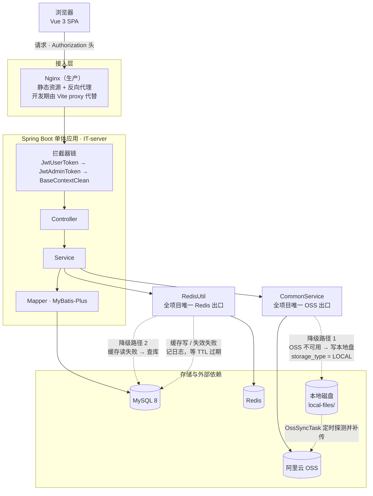

# ITHome · IT 之家协会管理系统

一个面向高校社团的一体化管理系统。协会成员可以浏览技术文章、下载学习资料、维护自己的资料和头像；非成员提交入会申请；会长和副会长在后台审批申请、管理花名册、导出花名册 Excel。后端是 Spring Boot 3 单体应用，前端是 Vue 3 单页应用，线上以 Docker Compose 部署在云服务器上。

项目本身不大，但**对「依赖挂了怎么办」这件事花了不少功夫**：Redis 和阿里云 OSS 都被当作「可降级的依赖」而不是「必须可用的依赖」，两条降级路径都落在了代码里，而不是只写在文档里。这一部分在下面的「核心难点」里展开。

---

## 技术栈

| 层 | 选型 |
| --- | --- |
| 语言 / 运行时 | Java 17 |
| 框架 | Spring Boot 3.2.2、Spring Framework 6.1.3 |
| 持久层 | MyBatis-Plus 3.5.7、MySQL 8.2、Druid 连接池 |
| 缓存 | Redis（Lettuce 客户端）、Spring Data Redis |
| 鉴权 | JJWT 0.12.1（JWT） |
| 对象存储 | 阿里云 OSS SDK 3.17.4 |
| 接口文档 | springdoc-openapi 2.6.0（Swagger UI） |
| 报表导出 | Apache POI 5.3.0（SXSSF 流式写） |
| 构建 | Maven 多模块 |
| 前端 | Vue 3 + Vite 5 + Pinia 3 + Vue Router 4（hash 模式） |
| 前端 UI | Element Plus、TipTap 3（富文本编辑器）、Axios |

---

## 系统架构



---

## 核心难点与解决方案

### 1. 缓存设计：分页缓存用 Hash 存、空值缓存防穿透、互斥锁防击穿

**要解决的问题**

文章列表（按编程语言分类的六个榜单 + 全部）是全站读得最多、写得很少的接口。每次分页都要 MySQL 做一次 `LIMIT` + 两个 `LEFT JOIN`（作者姓名和头像），首页流量又集中。

**缓存粒度为什么是「一页」而不是「一篇文章」**

分页结果的正确性取决于排序和总数的整体状态。缓存单篇文章的话，还要自己拼页，并且要处理新增 / 删除导致的页内位移；缓存整页则失效时只需删一个 key。

**为什么整组缓存装在一个 Hash 里**

缓存 key 是 `cache:articles:page`，field 是 `type:size:page`，value 是那一页的 `ArticleVO` JSON 数组。把 `size` 和 `page` 放进 field 而不是拼进 key，是为了让「清空整组缓存」永远是一次 `DEL`——否则新增一篇文章要按未知的 `size`/`page` 组合去 `SCAN` 匹配，或者干脆删不干净。

**为什么只缓存前 50 条**

`page * size - 1 < MAX_CACHE_SIZE`（50）才走缓存，超出直接查库。不设这个上界的话，客户端用一个很大的 `page` 就能无限往这个 Hash 里塞 field，field 数量没有上界，变成了一个可以被外部撑爆的内存增长点。

**空数组也是一个合法结果**

查不到文章时缓存的是 `[]`，不是空值。读的时候 `cached != null` 就直接反序列化返回，空列表也会被当成命中——「这一页确实没有文章」是一个可以缓存的结论，不需要每次都回源确认。

**防穿透：给「数据库里确实没有」也写一份缓存**

`RedisUtil.queryStringWithMutex` / `queryHashWithMutex` 在回源得到 `null` 时，会写一个哨兵值到独立的 key（`cache:null:...`，TTL 2 分钟）。这样不存在的学员 id 或资料 id 不会每次请求都击穿到数据库，同时 2 分钟的短 TTL 保证「后来真的创建了」也能很快恢复。

注意 Hash 版本的空值标记是**另一个独立 key**，不是 Hash 里的一个 field——Redis 的 Hash field 表达不了「值是空」和「field 不存在」的区别，读的时候两者都返回 `null`。

**防击穿：互斥锁 + 双重检查**

同一个 key 失效的瞬间，所有并发请求会同时发现未命中。做法是用 `setIfAbsent` 抢一把 `lock:*` 互斥锁：抢到的线程查库并回填，没抢到的自旋等待（50ms × 最多 20 次）。

进锁之后**必须再做一次查缓存**。因为等锁的这段时间里，可能已经有别的线程把值填好了；没有这次双重检查，锁就只起到了「串行化」的作用，每个排队线程进来还是会各查一次库。

**TTL 的两种策略**

- 分页缓存：2 小时，且每次写 field 时一起 `expire` 整个 key。整组共享一个过期时间，不会出现「早期的 field 永远不过期」。
- 学员信息、入会申请这类按 id 存的缓存：Hash field 不设 TTL，纯靠显式 `evictHashFields` 失效。这类数据是「改了就必须立刻看到」的，用 TTL 兜底反而会让用户看到过期信息。

**一个刻意的例外**

文章分页的写入路径**没有加锁**：整页一次性 `HSET`，value 是完整的一页，重复写同一个值没有副作用，并发未命中最多就是几个线程各查一次库、写进同一份结果。锁的价值在于「重建的代价远大于一次多余查询」，这里不成立。

---

### 2. 分布式锁：`setIfAbsent` 加锁 + Lua 原子释放 + 自动续期

**要解决的问题**

缓存重建这类操作，同一时刻全站应该只有一个线程在做。单机的 `synchronized` 在多实例部署下会失效，锁必须放在共享存储里。

**加锁**：`setIfAbsent(key, token, 10s)`，value 是一个每次加锁新生成的 UUID，不是线程名或主机名。用 token 的唯一目的，是让释放锁的时候能判断「这把锁还是不是我的」。

**释放必须原子**：走 Lua 脚本

```lua
if redis.call('get', KEYS[1]) == ARGV[1] then
    return redis.call('del', KEYS[1])
end
return 0
```

拆成 `GET` + `DEL` 两次调用的话，两次调用之间锁可能因为超时被回收并被另一个线程抢走，第二个 `DEL` 就会删掉别人的锁——锁失效、临界区重入。

**续期防止业务执行时间超过锁 TTL**：另起一个单线程 `ScheduledThreadPoolExecutor`，每 TTL/3（约 3.3 秒）跑一次续期脚本（同样是 `get` 比对 token 后 `pexpire`）。没有续期的话，一个慢请求持锁超过 10 秒，锁会自动释放，第二个线程进来重复执行临界区；有续期则锁一直归原持有者。

**抢不到锁时的处理是「限流」而不是「降级」**：自旋 20 次 × 50ms 后抛 `IllegalStateException("服务繁忙，请稍后重试！")`。这个异常**故意不是 `DataAccessException` 的子类**，所以不会被 `RedisUtil` 的降级逻辑吞掉，会一路冒到全局异常处理器。语义上这是主动的背压——「现在太挤了，别再全部压到数据库上」，和「Redis 连不上」是两回事。

**释放锁失败只记日志**：这段代码跑在 `finally` 里，异常抛出去会顶掉降级路径的返回值，让整个降级失效；而且锁本身带 TTL，没人删也会自己过期。这是「宁可留一把迟早会过期的锁，也不能让接口报错」的取舍。

---

### 3. Redis 降级策略：按用途分三类，而不是统一 try-catch

**要解决的问题**

Redis 挂了，业务应该「只是变慢」，而不是「全站 500」。但如果把 Redis 异常在整个项目里到处吞，就会出现「登录校验也吞掉异常然后放行所有人」这种事故。所以降级不能一刀切，得按用途分别定策略。

**设计：收口到一个类**

全项目只有 `RedisUtil` 一个类直接持有 `StringRedisTemplate`，每个方法自己消化异常，Service 层不再写 `try-catch`。降级行为按用途分三类：

| 用途 | 方法 | 失败时的行为 | 代价 |
| --- | --- | --- | --- |
| **缓存读** | `queryStringWithMutex`、`queryHashWithMutex`、`getHashField` | 降级查库 | 数据库压力上升、接口变慢，但结果正确 |
| **缓存写与失效** | `save`、`putHashField`、`evict`、`evictHashFields` | 记一行 warn 后吞掉 | 最坏结果是脏数据多留到 TTL 过期 |
| **登录态** | `isTokenValid` | 放行 | 已注销的 token 在 Redis 恢复前仍然有效 |

**登录态为什么选 fail-open**

白名单的意义是「注销即失效」，这个状态数据库里根本没有，所以这里不存在「降级查库」这个选项，只能二选一：

- fail-open（放行）：服务可用，代价是已注销的 token 在 Redis 恢复前仍然有效；
- fail-close（拒绝）：安全，代价是所有人被判为未登录，等于全站不可用。

选 fail-open 的理由是：JWT 签名本身已经能证明身份，白名单只是「让旧 token 提前失效」的**增强**，不是身份验证本身。拿「注销延迟生效」换「全站可用」是划算的。

**为什么 catch 的是 `DataAccessException` 而不是 `Exception`**

Redis 连接被拒、命令超时都是 `DataAccessException` 的子类；而抢锁重试耗尽抛的 `IllegalStateException` 不属于它。**异常类型在这里同时承担了「技术故障」和「主动限流」的区分**——技术故障吞掉并降级，主动限流继续往上抛。如果 catch `Exception`，第二类就会被误当成第一类吞掉，背压就失效了。

**配套：让失败尽快发生**

`OssConfiguration` 里给 Lettuce 配了 `DisconnectedBehavior.REJECT_COMMANDS`：连接断开时直接拒绝命令，不排队等超时。Redis 不可用时希望请求快速走降级路径，而不是每个请求都卡在命令超时上。

**降级日志故意不打堆栈**

Redis 不可用是「已经处理掉的预期内故障」，不是意外：堆栈从 `RedisUtil` 往下全是 Lettuce / Spring 的库内调用，对定位没有帮助，而每个请求都会走到这里，打堆栈等于按请求刷屏。日志只取根因的类名 + message——连接被拒、超时、还是命令报错，一眼能分。

---

### 4. OSS 降级与自愈：本地落盘 → 定时补传 → URL 改写 → 302 兜底

**要解决的问题**

文章配图、资料附件、头像都存在 OSS。OSS 抖动时如果上传直接失败，用户写了一半的文章里图片就没了；就算事后再传，写进正文 HTML 的 URL 也已经是坏的了。

**上传：失败就落本地盘**

`CommonServiceImpl.upload` 是全项目唯一碰 OSS 的地方。OSS 抛异常时降级写本地磁盘，记录标 `storage_type = LOCAL`，`file_url` 存 `/user/common/local/{objectName}`。

`file_url` 为什么存本地路径而不是留 `null`：这一列直接喂给 ``；更要紧的是 `UploadArticle.vue` 是把返回的 `fileUrl` 烧进正文 HTML 存库的——留 `null` 那张图就**永久**坏掉，OSS 恢复了也不会自愈。

**补传：`OssSyncTask`**

每 5 分钟捞一次 `storage_type = 'LOCAL'` 的记录：

1. 每轮**先探一次 OSS**（`doesBucketExist`），不通就直接返回。不拿 N 个必败的上传去砸一个已经挂了的服务。
2. 探通了才逐个丢给共享线程池并发补传。
3. 单个文件的三步顺序是：上传到 OSS → 成功后更新数据库为 `OSS` 并回填 `file_url` → **最后**才删本地副本。任何一步失败，本地副本都还在，所以重传是安全且幂等的（OSS 同名覆盖）。
4. 不加分布式锁：多实例部署下会重复上传同一个 `objectName`，OSS 同名覆盖本身就是幂等的，代价只是白传一次，不值得为它引一个锁。
5. 用 `fixedDelay` 而不是 `fixedRate`：配合默认的单线程调度器，这轮没跑完就不会起下一轮，天然不会自我重叠。

**自愈：正文里烧死的那个本地 URL 怎么办**

补传成功后 `file_url` 被改写成了 OSS 地址，但正文 HTML 里写死的还是 `/user/common/local/{objectName}`。这个地址不能坏，所以下载接口做了三态处理：

- 本地副本还在 → 直接流出去；
- 本地副本已经被补传任务清掉 → **302 重定向**到 `file_url` 里回填好的 OSS 地址；
- 两者都没有（补传没成功，`file_url` 还是本地路径）→ 返回 404。这一条是必须挡的，否则会 302 到自己，无限重定向。

反过来，如果 `storage_type` 已经是 `OSS`、但本地副本因为删除失败还留在盘上，也直接读它——字节是一样的。所以判断依据是「盘上有没有文件」，而不是 `storage_type`。

**路径安全：`objectName` 的两个来路都不可信**

上传时由用户文件名拼出来，下载时直接来自请求参数，两处都做了处理：

- 后缀只保留字母数字并截断到 16 字符。原来直接 `substring(lastIndexOf("."))`，而 `"a.../../x"` 这样的文件名取出来的「后缀」自带斜杠和 `..`——写 OSS 时 object key 里带这些无所谓，但降级写本机磁盘时就是一次路径穿越。
- `LocalFileStorage.resolve` 把 `objectName` 解析成绝对路径后 `normalize()`，再校验 `startsWith(baseDir)`，不通过返回 `null`。这是最后一道边界，不依赖调用方过滤。

**顺手堵的一个洞**

本地文件预览接口是免登录的（`` 发不出 `Authorization` 头），而 `Content-Type` 由上传者控制。所以只对确定安全的位图内联返回（`image/*` 且不含 `svg`），其余一律退回附件下载——否则一个 `image/svg+xml` 内联返回，就是一次同源的存储型 XSS。

---

### 5. 缓存与数据库的先后顺序

**要解决的问题**

Redis 不参与数据库事务：事务回滚不会把已经删掉的缓存加回来。所以「先动缓存还是先动库」这个顺序，错了就会出问题。

代码里的写操作统一是：**先写库，确认影响行数，再失效缓存**。

```java
// ArticlesServiceImpl.update
if (articleMapper.updateById(article) == 1) {
    redisUtil.evict(CACHE_ARTICLE_PAGES);
    ...
}
```

两个理由：

1. **只有数据库真的写成功了才值得失效缓存。** 影响 0 行说明这次更新没落地，此时把缓存删掉等于白白丢掉一份仍然正确的缓存，下一个请求还要回源查一次。
2. **不能反过来先删缓存再写库。** 那样会打开一个窗口：缓存已删、库里还是旧值，此时并发的读请求会把**旧值**重新回填进缓存，而缓存不设短期过期（分页缓存 2 小时），脏数据会一直留在那儿。Cache-Aside 的「先库后缓存」虽然也不是绝对无窗口，但它要求「读操作比写操作还慢」才会出问题，概率低得多，而且不会长期脏。

**同样的推理也用在文件删除上**：删文章时要顺带删掉正文里引用的 OSS 图片，代码是先把 `objectName` 从正文里抠出来存好，等 `deleteById` 返回 1 之后才真正调用 `commonService.delete`。顺序反过来的话，事务回滚时图片已经删了，而数据库里还留着对它的引用。

**已知边界**：`evict` 调用发生在 `@Transactional` 方法体内，也就是在事务提交之前执行。它依赖「影响行数 = 1」来区分「业务失败」和「正常路径」，正常路径下即使外层事务因为别的原因回滚，最坏结果也只是缓存提前失效、下次读回源，不会读到脏数据。如果要做到严格意义上的「提交后失效」，需要挂 `TransactionSynchronization.afterCommit`。

---

### 6. 并发重复提交：唯一索引兜底 + 悲观锁

**要解决的问题**

入会申请和审批是典型的「检查再写入」，并发下会产生重复数据。应用层先查一遍数据库的写法，只能做到「常见路径的快速失败」——两个请求完全可以同时查到「不存在」，然后各插一条。

**第一层：唯一索引兜底（`applyJoin`）**

应用层先查一次给出友好提示，但真正保证正确性的是数据库上 `newcomer.student_id` 的唯一索引：

```java
try {
    if (!this.save(newComer)) { ... }
} catch (DuplicateKeyException e) {
    // 并发请求由数据库唯一索引兜底，并转换为统一业务异常
    throw new ParameterException(MessageConstant.REPEATREQUEST);
}
```

把数据层的 `DuplicateKeyException` 翻译成统一的业务异常，调用方拿到的还是「重复申请」这句人话，而不是一个 500。全局异常处理器里另有一条 `@ExceptionHandler(DuplicateKeyException.class)`，作为没有被显式捕获时的兜底。

**第二层：悲观锁（`agreeNewcomer` / `refuseNewcomer`）**

审批是「读记录 → 判断 → 写」的组合，必须在事务里把这条申请锁住：

```sql
select * from newcomer where id = #{id} for update
```

否则两个管理员同时点「通过」，会各自读到「还没审批」，然后各插一条学员记录。

这里还有一处刻意的选择：**判断学生是否已存在时不走缓存**。缓存里可能还是「不存在」的旧值，用它做判断同样会导致重复创建——写路径必须以数据库为准。

---

### 其余工程细节

| 点 | 做法 | 为什么 |
| --- | --- | --- |
| ThreadLocal 清理 | `BaseContextCleanInterceptor.afterCompletion` 里 `remove()`，注册在拦截器链最后并覆盖 `/**` | Tomcat 复用工作线程。不清理的话上一个请求的 `studentId` 会残留在池里的线程上，被下一个请求（尤其是免登录白名单里的接口）读到，造成越权或数据错乱 |
| 全局异常分类 | 业务异常 / 请求参数问题 / 数据层 / 兜底，四类 handler | 日志级别和对外文案分开：前三类 WARN 记一行、原因可原样返回；兜底 ERROR 打完整堆栈、对外只回一句固定文案——异常信息里可能带着 SQL、类名、文件路径。日志只记 URI 不记 query string，因为 JWT 支持从查询参数取，打全量 URL 会把 token 写进日志 |
| 统一响应 `Result<T>` | HTTP 状态码恒为 200，业务结果由 body 里的 `code` 表达 | 前端的 axios 响应拦截器只在 2xx 时返回 body，改 HTTP 状态码调用方就拿不到 `code`/`msg` 了。二进制接口（文件下载）是例外，直接用 HTTP 状态码 |
| 参数校验 | DTO 上 `@Valid` + 字段约束，Controller 参数上 `@Validated` + `@Min`/`@NonNull` | 对应两个 handler：`MethodArgumentNotValidException`（请求体）和 `HandlerMethodValidationException`（方法参数）。多条校验消息去重后拼接返回 |
| 异步任务线程池 | `AsyncExecutors` 全 JVM 共享的静态 `ThreadPoolExecutor`（4~8 线程，队列 100），拒绝策略 `CallerRunsPolicy` | 避免各处 `new Thread()` 导致线程数失控；队列满时任务退回调用线程执行——宁可拖慢这一次请求，也不静默丢任务。线程设为守护线程并挂了 `UncaughtExceptionHandler` |
| 日志脱敏 | `ControllerLogAspect` 环绕所有 `@RestController` | 递归把 `password`、`token`、`authorization`、`secret`、`accessKey*` 等字段替换成 `******`，超过 1000 字符的字符串截断；`MultipartFile` 只记文件名、大小、类型，不记内容 |
| 消除 N+1 | `UsersServiceImpl.getAll` 用两个 `GROUP BY student_id` 的聚合查询算出每个成员的文章数 / 资料数，头像用 `selectBatchIds` 一次取回 | 逐个成员 count 的话，50 个成员要 100 次查询 |
| Excel 流式导出 | `SXSSFWorkbook(100)` 滑动窗口 + `dispose()` | 花名册是整表导出，普通 `XSSFWorkbook` 会把所有行留在内存里 |
| 越权防护 | `update` 时归属以主键查出的真实记录为准；`studentId` 强制置空、非管理员 `position` 强制置空 | 请求里同时带主键 `id` 和业务字段 `studentId`：拿请求传来的 `studentId` 做校验，攻击者填上自己的学号 + 别人的主键就能通过校验、却按主键改掉别人的记录。`position` 不置空的话，任何人都能把自己改成 admin |
| 最后一个管理员不能注销 | `removeSelf` 里判断 `countByPosition(admin) <= 1` | 否则后台彻底锁死：没人能审批新成员、没人能删人、也没人能改别人的信息 |
| 枚举 code 显式声明 | `ArticleType` 用手写 code，不用 `ordinal()` | 这个 code 同时写进数据库的 `type` 字段和缓存的 field，依赖 `ordinal()` 的话枚举顺序一调整，数据就对不上 |
| 文件访问免登录的安全性 | 白名单放行 `/user/common/local/**` | `` 发不出 `Authorization` 头，只能免登录。`object_name` 是 UUID 不可枚举，和 OSS 那边上传后返回的裸 URL 是同一套「拿到名字才能看」的模型，安全模型没有变差 |

---

## 项目结构

```
ITHome/
├── backend/                          Maven 多模块
│   ├── IT-common/                    工具、常量、配置属性、异常、统一响应
│   │   ├── utils/RedisUtil.java      全项目唯一 Redis 出口，含降级与分布式锁
│   │   ├── utils/LocalFileStorage     OSS 降级时的本地兜底存储（路径安全边界）
│   │   ├── utils/AsyncExecutors       全局共享的异步线程池
│   │   ├── utils/AliOssUtil           OSS 上传 / 下载 / 删除 / 可用性探测
│   │   ├── context/BaseContext        请求级 ThreadLocal
│   │   └── resources/lua/             释放锁、续期的 Lua 脚本
│   ├── IT-pojo/                      实体、VO、DTO
│   ├── IT-server/                    可运行模块
│   │   ├── controller/user|admin/    按调用方角色分包的接口
│   │   ├── service/impl/             业务实现（缓存、降级、权限都在这一层）
│   │   ├── interceptor/              两个 JWT 拦截器 + ThreadLocal 清理拦截器
│   │   ├── globalException/          全局异常分类处理
│   │   ├── task/OssSyncTask          本地降级文件的定时补传
│   │   ├── aspect/                   控制器出入参与脱敏日志
│   │   └── resources/mapper/         MyBatis XML
│   └── data.sql                      建库建表脚本
└── frontend/                         Vue 3 + Vite
    └── src/
        ├── request/                  按领域拆分的 axios 模块 + 统一实例
        ├── router/                   路由表 + 登录 / 角色守卫
        ├── stores/                   Pinia（用户、通知、可见性、上传等）
        ├── views/                    页面组件（全部懒加载）
        └── components/               导航栏、登录弹窗等公共组件
```

---

## 本地运行

### 环境要求

JDK 17、Maven、MySQL 8、Redis。前端需要 Node.js（Vite 5 要求 18+）。

### 后端

**1. 建库建表**

`backend/data.sql` 里是完整的建表语句和一份初始数据。

> 注意：这个文件的第一行是 `drop database if exists ithome;`。导入前请确认没有正在使用的同名数据库，不要在生产环境执行。

**2. 配置**

`application.yml` 里所有敏感项都是 `${...}` 占位符，没有硬编码，仓库里也不含任何凭证。本地的值有两种给法：写在自己的 `application-dev.yml`（该文件已在 `.gitignore` 里），或者直接设置成环境变量。

| 环境变量 | 说明 |
| --- | --- |
| `SPRING_DATASOURCE_URL` / `SPRING_DATASOURCE_USERNAME` / `SPRING_DATASOURCE_PASSWORD` | MySQL 连接 |
| `SPRING_REDIS_HOST` / `SPRING_REDIS_PORT` / `SPRING_REDIS_PASSWORD` / `SPRING_REDIS_DATABASE` | Redis 连接（`database` 默认 0） |
| `OSS_ENDPOINT` / `OSSACCESS_KEY_ID` / `OSS_KEY_SECRET` / `OSS_BUCKET_NAME` | 阿里云 OSS。没有 OSS 也能跑起来：上传会自动降级到本地磁盘，只是补传任务会一直失败 |
| `JWT_SECRET_KEY` / `JWT_TOKEN_NAME` / `JWT_TTL` | 签发 token 用；`JWT_TOKEN_NAME` 要和前端请求头里的名字一致 |
| `LOCAL_FILE_DIR` | OSS 降级文件的落地目录，默认 `./local-files`。启动日志会打出解析后的绝对路径 |

**3. 启动**

```bash
cd backend
mvn clean install -DskipTests
mvn -pl IT-server spring-boot:run
```

接口文档：`http://localhost:8080/swagger-ui/index.html`

### 前端

```bash
cd frontend
npm install
npm run dev
```

开发期的跨域由 Vite 代理解决，`vite.config.js` 把 `/user`、`/admin`、`/v3/api-docs` 转发到 `http://localhost:8080`：

```js
server: {
  proxy: {
    "/user": "http://localhost:8080",
    "/admin": "http://localhost:8080",
  },
},
```

前端 axios 实例的 `baseURL` 留空，代码里不出现后端地址——开发期走 Vite 代理，生产环境前后端同域由 Nginx 路由，两边都不需要改代码。

---

## 待补充

这份 README 里的结论目前都来自代码推理，还没有实测数据支撑。要让它更有说服力，需要补上下面这些：

**压测数据**

- <!-- 已完成，见 perf/REPORT.md --> 文章分页接口在「缓存命中」和「缓存未命中（直查 MySQL）」两种情况下的 P99 与 QPS 对比。实测结论与预期相反：这个接口的吞吐由响应体大小决定，不由缓存决定——13.4KB 的缓存命中响应是 65 rps，2.9KB 的直查库响应是 305 rps，两者 TTFB 中位数只差 0.1ms（服务端开销被 58ms 网络往返淹没）。四条不同响应体大小的压测线聚合带宽都落在 7.0–7.3 Mbps，独立下载验证为 7.85 Mbps，瓶颈是服务器出口带宽。同一轮压测还测出：Druid 连接池默认 8 连接，真查库的接口在 50 并发下是 514 rps，100 并发塌到 108 rps（零错误）。复现脚本在 `perf/`。
- <!-- TODO: 压测后填 --> Redis 停掉前后，同一组接口的响应时间对比——用来验证「Redis 挂了只是变慢，不是不可用」这个结论，现在它只是设计意图。
- <!-- TODO: 压测后填 --> 缓存击穿场景下的锁等待比例：`acquireLockWithRetry` 的重试上限是 20 次 × 50ms，真实流量下会不会被打满、直接把「服务繁忙」抛给用户。
- <!-- TODO: 压测后填 --> OSS 降级上传路径（写本地磁盘）与正常上传路径的耗时对比。

**监控与观测**

- 缓存命中率：目前没有埋点，只能从日志里数降级 warn 的行数。要给出准确数字需要引入 Micrometer 计数器——`application.yml` 里留了一行注释说明现状：pom 里既没有 `spring-boot-starter-actuator` 也没有 `micrometer-registry-prometheus`，`/actuator/**` 全是 404，要做监控得先把依赖加上。
- OSS 降级的实际发生频率、补传积压的条数与最长积压时长：`OssSyncTask` 目前只打日志，没有 metrics。

**正确性验证**

- 已覆盖的部分：`IT-common` 下有两个测试类。`LocalFileStorageTest` 覆盖写读删和路径穿越（父目录穿越、绝对路径越界、空名字、目录未配置时快速失败）；`RedisUtilTest` 用 Mockito 覆盖缓存命中 / 未命中回源、空值缓存、以及「进锁后双重检查发现别人已经填好了」这条分支。
- 缺口一：并发重复提交。唯一索引兜底和 `selectByIdForUpdate` 目前只有代码推理，缺一个并发的集成测试。
- 缺口二：分布式锁的续期。缺一个「业务执行时间超过锁 TTL」的用例，用来证明续期确实生效、锁没被提前释放。
- 缺口三：OSS 降级链路。单元测试只覆盖到本地存储这一层，「降级写盘 → 定时补传 → `file_url` 改写 → 302 到 OSS」的完整链路没有端到端验证。

**前端**

- <!-- TODO: 构建后填 --> `npm run build` 的产物体积与首屏加载时间。

**部署**

- 多实例场景下的缓存一致性与 OSS 补传的重复上传都还没实测：当前是单实例部署，`OssSyncTask` 里也写明了「没有加分布式锁，单实例下没问题」。
