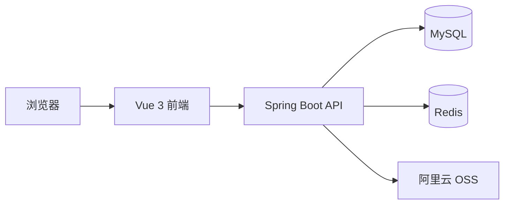

# ITHome

ITHome 是一个面向高校 IT 社团的前后端分离管理系统，提供技术文章、学习资料、入会申请、成员信息和社团后台管理等功能。

本文档只介绍 `backend`、`frontend` 和 `perf`，不包含 `ai-backend`。

## 功能

- 浏览、发布、修改和删除技术文章
- 按分类分页查看文章
- 上传、下载和管理学习资料
- 用户登录、资料维护、头像上传和账号注销
- 提交入会申请
- 管理员审批入会申请、维护成员名单
- 导出成员信息 Excel
- JWT 身份认证和角色权限控制
- Redis 数据缓存、缓存穿透与击穿防护
- 阿里云 OSS 文件存储

## 技术栈

### 后端

- Java 17
- Spring Boot 3.2.2
- MyBatis-Plus 3.5.7
- MySQL 8
- Redis / Spring Data Redis
- JWT
- 阿里云 OSS
- Apache POI
- springdoc-openapi
- Maven 多模块

### 前端

- Vue 3
- Vite 5
- Vue Router 4
- Pinia 3
- Element Plus
- Axios
- TipTap

## 系统架构



前端通过 Axios 调用后端接口。开发环境下，Vite 将 `/user`、`/admin` 和 `/v3/api-docs` 请求代理到 `http://localhost:8080`。

## 项目结构

```text
ITHome/
├── backend/
│   ├── IT-common/          公共配置、工具类、异常和统一响应
│   ├── IT-pojo/            Entity、DTO 和 VO
│   ├── IT-server/          Controller、Service、Mapper 和启动类
│   ├── data.sql            MySQL 初始化脚本
│   └── pom.xml             Maven 父工程
├── frontend/
│   ├── public/             静态资源
│   ├── src/
│   │   ├── components/     公共组件
│   │   ├── request/        Axios 请求模块
│   │   ├── router/         路由和访问守卫
│   │   ├── stores/         Pinia 状态管理
│   │   └── views/          页面组件
│   └── package.json
├── perf/                   k6 压测脚本和结果
└── README.md
```

## 环境要求

- JDK 17
- Maven 3.8+
- Node.js 18+
- MySQL 8
- Redis

文件上传和下载依赖阿里云 OSS。需要使用文件相关功能时，请提供有效的 OSS 配置；当前项目没有本地存储降级和自动补传机制。

## 本地运行

### 1. 初始化数据库

执行数据库脚本：

```bash
mysql -u root -p < backend/data.sql
```

脚本会删除并重新创建名为 `ithome` 的数据库，请勿直接用于已有数据的环境。

### 2. 配置后端

后端从环境变量读取数据库、Redis、OSS 和 JWT 配置。常用变量如下：

| 环境变量 | 说明 |
| --- | --- |
| `SPRING_DATASOURCE_URL` | MySQL JDBC 地址 |
| `SPRING_DATASOURCE_USERNAME` | MySQL 用户名 |
| `SPRING_DATASOURCE_PASSWORD` | MySQL 密码 |
| `SPRING_REDIS_HOST` | Redis 地址 |
| `SPRING_REDIS_PORT` | Redis 端口 |
| `SPRING_REDIS_PASSWORD` | Redis 密码 |
| `SPRING_REDIS_DATABASE` | Redis 数据库编号，默认 `0` |
| `JWT_SECRET_KEY` | JWT 签名密钥 |
| `JWT_TOKEN_NAME` | Token 请求头名称，建议设为 `authorization` |
| `JWT_TTL` | Token 有效期，单位为毫秒 |
| `OSS_ENDPOINT` | OSS Endpoint |
| `OSSACCESS_KEY_ID` | OSS AccessKey ID |
| `OSS_KEY_SECRET` | OSS AccessKey Secret |
| `OSS_BUCKET_NAME` | OSS Bucket 名称 |

可以通过环境变量配置，也可以在本地创建已被 Git 忽略的文件：

```text
backend/IT-server/src/main/resources/application-dev.yml
```

配置示例：

```yaml
spring:
  datasource:
    url: jdbc:mysql://localhost:3306/ithome?useUnicode=true&characterEncoding=utf8&serverTimezone=Asia/Shanghai
    username: root
    password: your-password
  data:
    redis:
      host: localhost
      port: 6379
      password: ""

front-location:
  request-url: http://localhost:5173
```

不要将真实密码、JWT 密钥或 OSS 密钥提交到仓库。

### 3. 启动后端

```bash
cd backend
mvn clean install -DskipTests
mvn -pl IT-server spring-boot:run
```

后端默认地址：`http://localhost:8080`

Swagger UI：`http://localhost:8080/swagger-ui/index.html`

OpenAPI 文档：`http://localhost:8080/v3/api-docs`

### 4. 启动前端

```bash
cd frontend
npm ci
npm run dev
```

前端默认地址：`http://localhost:5173`

## 构建

### 后端

```bash
cd backend
mvn clean package -DskipTests
```

生成的可运行包位于 `backend/IT-server/target/`。

### 前端

```bash
cd frontend
npm ci
npm run build
```

构建结果位于 `frontend/dist/`。

## 主要接口

| 路径 | 用途 |
| --- | --- |
| `/user/users` | 登录和用户资料管理 |
| `/user/articles` | 文章查询与管理 |
| `/user/resources` | 学习资料查询与管理 |
| `/user/newcomers` | 入会申请 |
| `/user/common` | 公共文件访问 |
| `/admin/newcomers` | 入会申请审批 |
| `/admin/users` | 成员管理和 Excel 导出 |

除公开接口外，请求需要携带 JWT：

```http
Authorization: <token>
```

实际请求头名称由 `JWT_TOKEN_NAME` 配置决定。

## 性能测试

`perf` 目录包含基于 k6 的文章分页接口压测脚本。安装 k6 后可按具体场景执行，例如：

```bash
k6 run perf/getpage_smoke.js
```

压测前请检查脚本中的目标地址和测试参数，避免误请求生产环境。
